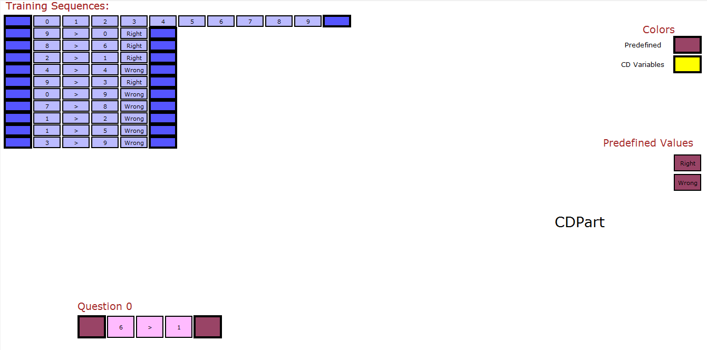

# Common-Description Learning (CDL)
This is a new framework to learn simples patterns from a few number of examples and use them to learn harder ones. the learned models
are perfectly interpretable and its depth depends on the question. By 'depth' I mean that whenever needed the model learns to break down the problem into simpler subproblems and solve them first.
The paper can be found at: arxiv..   
     
CDL is a library written in C++ implements algorithms explaind in the paper and tested on 32 small datasets
Directories included in the library
-----------------------------------
`CDL/`   - source code  
`Dataset/`   - dataset divided into three groups (Group_A: 25 small datasets, Group_B: 5 small datasets,Group_C: 2 small datasets)   

`results/`   
* 3 outputFiles: contain MGICDs learned in each group of datasets and some statistics about training
* 32 animation files that explain how MGICDs solve the test questions, they can be shown by calling `animate.py` but need first to to change the directory of the animation file in the first line, and you can also change the animation speed by changing the value of nodeTime
* Most of CDs in the outputFiles can be displayed by `visualizeCD.py`, but need first to copy it to CD.txt

License
---------------------
This project is licensed under the terms of the MIT license

Installation
---------------------
Usage
---------------------
Tasks
---------------------
Code Overview
---------------------

Example : three one-digit numbers addition Group_B (dataset_2)
---------------------

   

Example: reverse task Group_A (dataset_19)
---------------------

   

Example: Group_B (dataset_3)
---------------------

   

Example: Group_A (dataset_24)
---------------------

